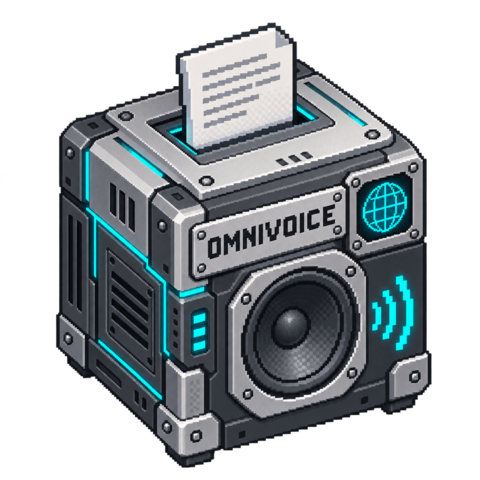

# OmniVoice

<!-- block-metadata:start -->

Verified BloxSmith versions: **1.0.9** (bundled-block tests; see [test evidence](compatibility.json)).
<!-- block-metadata:end -->

Run **k2-fsa/OmniVoice** locally: diffusion-based speech synthesis with automatic voice selection, voice design, or authorized voice cloning. This is the official model and its bundled HiggsAudioV2 codec, not an agent CLI, a hosted API or a same-name substitute.

## Connect it

| Port | Direction | Contents |
| --- | --- | --- |
| text | Input | Plain text, or an application/json object containing exactly text and request_id. |
| command | Input | JSON {"action":"interrupt"}; cancel the active job and clear earlier pending requests. |
| audio_file | Output | Unique absolute path of a completed WAV or Ogg/Opus file. |
| metadata | Output | Correlation ID, model/SDK revisions, native steps/chunks, durations, format, byte count and SHA-256. |
| status | Output | Completion, interruption, queue state or a recoverable diagnostic. |

Plain text remains speech even when it looks like a JSON command. Controls belong on their own port. Names, not visual port order, select behavior. Request IDs correlate results; repeating an ID intentionally starts another synthesis, not durable exactly-once delivery.

No live audio_stream port is claimed. A completed path is not a stream frame; a file-to-stream adapter must explicitly make that transition before an audio-only player.

## Prepare the local model

Requirements: Linux, FFmpeg and a dedicated **Python 3.12** environment with [requirements.txt](requirements.txt). Install an appropriate CPU or CUDA PyTorch build separately from the framework. The adapter verifies the OmniVoice SDK version and exact Git installation commit through direct_url.json.

The pinned snapshot needs **3,267,467,171 bytes**, plus dependencies and working space. Runtime never downloads weights or installs packages. Inspect first:

~~~sh
python setup_model.py --directory MODEL_ASSETS
~~~

The default helper is read-only. After reviewing the upstream licenses and ensuring sufficient space, an explicit download is available:

~~~sh
python setup_model.py --directory MODEL_ASSETS --download-public
~~~

All model, tokenizer, codec and configuration files are pinned by immutable revision, size and SHA-256/LFS or Git-blob checksum in [model_artifacts.json](model_artifacts.json). Corrupt, symlinked or undeclared files inside model/ are refused. Existing corrupt assets are never overwritten. The downloader requires an additional 1 GiB disk margin before starting.

Runtime uses verified local files, offline Hugging Face settings, a private job cache and a supervised child process. It does not upload text/audio, use secrets or fall back to a cloud provider. Separate process supervision is **not** an OS security sandbox.

## Voice modes and language

- **Automatic:** no reference or attributes; the model selects a voice. Stable identity across separate requests is not guaranteed.
- **Voice design:** comma-separated native attributes, one per category. Gender: male/female. Age: child, teenager, young adult, middle-aged, elderly. Pitch: very low pitch, low pitch, moderate pitch, high pitch, very high pitch. Style: whisper. Accent: american, british, australian, canadian, indian, chinese, korean, japanese, portuguese or russian, each followed by “accent”. Chinese dialects: 河南话, 陕西话, 四川话, 贵州话, 云南话, 桂林话, 济南话, 石家庄话, 甘肃话, 宁夏话, 青岛话, 东北话. Chinese equivalents for gender/age/pitch/style are accepted by the native SDK. Conflicting categories or mixing a Chinese dialect with an English accent are refused. Voice design was trained on English/Chinese; other-language quality is not promised.
- **Reference voice:** provide both an authorized, completed local audio file and its exact transcript. Reference duration is 0.5–20 seconds, at most 32 MiB; 3–10 seconds is recommended upstream. The block privately snapshots and converts it to 24 kHz mono without changing or silently cropping the original. A transcript is mandatory to prevent implicit Whisper loading. No arbitrary serialized voice-prompt files are accepted.

Language uses Auto or one of the **652 distinct IDs** in the pinned SDK catalog. The searchable list shows upstream English language names, not invented localized aliases. This is a declared capability list, not pronunciation-quality certification across those languages.

Text passes to the SDK without optional text-normalization packages or downloads. Native pronunciation and non-verbal tags stay intact. Write numbers as words if needed. Optional reference preprocessing removes long silences and adds punctuation on the owned copy only.

## Generation and bounds

- CPU uses float32. CUDA 0 supports explicitly chosen float32, float16 or supported bfloat16; no silent precision/device fallback. The codec stays float32.
- The default RAM preflight is 8 GiB, supplemented by weight-based RAM/VRAM checks plus working margins. Checks do not reserve memory or predict peak use.
- Default 32 diffusion steps, configurable from 1 to 64. Native guidance, time shift, codebook-layer penalty and position/code temperatures are exposed in Advanced settings.
- Optional duration is frame-quantized at 25 Hz and overrides speed. Native post-processing may shorten it; edge padding counts toward the total limit. The default maximum is 60 seconds, configurable up to 90.
- Native long-form segmentation is retained, with a default 15-second target and 30-second threshold. Every planned chunk must complete; maximum 16 chunks. Generation is refused before an excessive estimated allocation or cumulative chunk duration. Chunks are decoded in native order with native crossfades.
- Default 1,000 text characters, 4,096 context tokens, four pending requests and a 240-second whole-request deadline. Limits include verification, loading, inference, encoding and publication.

OmniVoice does not use an autoregressive speech EOS for completion. The adapter checks native forward-step counts, all eight audio-code channels, absence of unresolved mask tokens, expected chunk count and ordered decoding. These checks prove protocol completion, **not** that every requested word was pronounced correctly.

The block emits mono PCM16 WAV at 24 kHz or complete Ogg/Opus at 48 kHz. Non-finite, empty, silent or excessively out-of-range output is refused. Values beyond the PCM range are clipped with a reported clipped_samples count.

## Run, interruption and storage

One Shot performs one synchronous bounded synthesis. Active Runtime starts a lightweight listener at Run but loads no model until new text arrives. One job runs at a time; a bounded pending queue holds later texts. A zero queue limit rejects incoming text while busy.

An accepted interrupt terminates the owned generation process and discards earlier pending texts. Later requests remain possible without restarting Run. It does not recall already-published files or mute a downstream player; send that player its own interrupt.

Stop and abrupt worker-host death fence the owned process group. No detached inference server, global process kill or framework modification is used. The model reloads for every request; this is not a warmed low-latency server.

Publication occurs after the listener drains accepted commands. Only complete files receive unique atomic names, with no overwrites. An empty destination uses the persistent node audio/ directory returned by the public block-storage service. Published audio is not automatically deleted. Normal temporary jobs are cleaned; abrupt host termination can leave unreferenced private job directories, never published as completed audio.

The modal and inspector use labelled English/French settings, conditional voice fields, Advanced settings and explicit Apply/Cancel behavior. Reload a prepared Run after saving settings.

## Verification scope

The block suites use explicit SDK/model doubles, genuine subprocesses and FFmpeg codecs, both execution modes and bundled/managed/linked installation origins. They test cancellation, malformed/incomplete chunks, reference bounds and source preservation, atomic publication, SDK provenance, asset integrity and responsive translated UI.

**Actual CPU smoke inference passed on 2026-10-05** using the pinned SDK and real weights,
float32, two Torch threads and 32 diffusion steps. The English example produced 3.62 s
of complete Ogg/Opus in 103.40 s; French produced 4.04 s in 112.82 s. These times include
per-request verification/loading, inference and encoding, not dependency installation.
This configuration is not low-latency conversational speech. Listening quality, CUDA,
Raspberry Pi and network-denied execution are not certified by this smoke test.
The framework/runtime suites still use explicit model doubles. The private evidence
is `tests/results/run-zv7dp311/report.json`; its roughly 4.8 GiB temporary environment,
models and generated audio were deleted after testing. The workspace helper
`tests/qualify_omnivoice_cpu.py` displays a plan by default; `--execute` repeats the
real qualification in an automatically cleaned temporary environment.

On a separately prepared host:

~~~sh
# Read-only prerequisite inventory:
python tests/qualify_model.py --directory MODEL_ASSETS --python INFERENCE_PYTHON

# Explicit real English/French smoke inference:
python tests/qualify_model.py --directory MODEL_ASSETS --python INFERENCE_PYTHON \
  --execute --results-directory TEST_RESULTS

# Add --device cpu --precision float32 for CPU.
# Optional authorized clone: --reference AUDIO_FILE --reference-text "Exact words."
~~~

Listen to both complete examples and record the hardware, Stop behavior, runtime integration and measured resources separately. The helper never downloads weights. The proprietary framework test harness is not redistributed in this block repository.

## Upstream and licensing

This block's original code is **Apache-2.0**. The OmniVoice SDK and main model declare Apache-2.0. The bundled audio-tokenizer snapshot instead carries the **Boson Higgs Audio 2 Community License**, incorporating Meta Llama 3 terms. Do not assume the whole inference stack has the block's Apache license. Review the codec terms, applicable use/attribution requirements and commercial conditions before deployment or redistribution. Model weights and SDK sources are obtained separately, not bundled here.

The language-ID data is derived from the Apache-2.0 OmniVoice language catalog, copyright 2026 Xiaomi Corp., author Han Zhu. The native API is invoked without changing upstream files.

- [Official OmniVoice project](https://github.com/k2-fsa/OmniVoice)
- [Pinned SDK source](https://github.com/k2-fsa/OmniVoice/tree/08be0b4ccbac3e13e374e86fbfead4b4cac343e2)
- [Pinned model and codec files](https://huggingface.co/k2-fsa/OmniVoice/tree/c5fdb5ccb189668d56333f77ba2629f4cd7535f4)
- [Bundled codec license](https://huggingface.co/k2-fsa/OmniVoice/blob/c5fdb5ccb189668d56333f77ba2629f4cd7535f4/audio_tokenizer/LICENSE)
